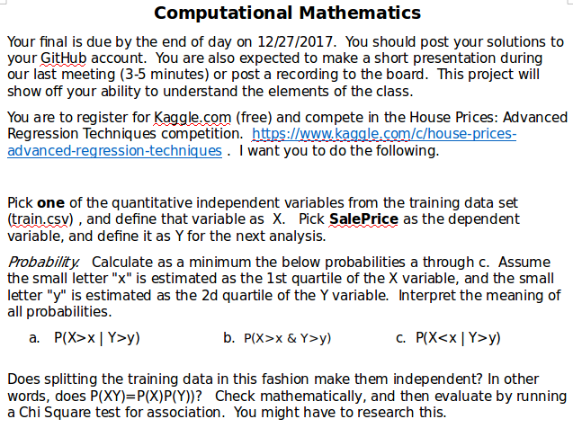
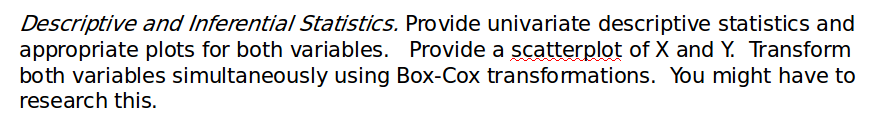
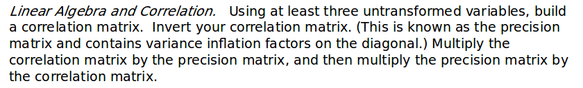
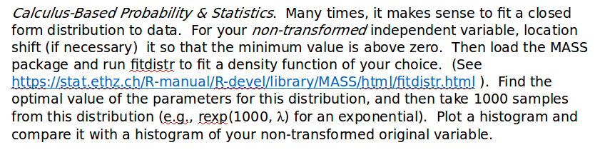
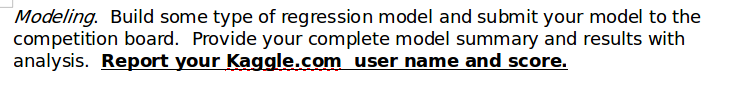

```{r, echo=T, warning=F, message=F}
library(knitr)
library(ggplot2)
library(stats)
library(kableExtra)
library(grid)
library(gridExtra)
library(MASS)
library(data.table)
library(RCurl)
options(scipen=8)
set.seed(0305)
```

**_Problem: 1_**



******

**_Solution:_**

To answer the above question I will using data from `GrLivArea` column, according to documentation it is described as _Above grade (ground) living area square feet_. This column will be `X`, independent variable and `Y` would be `SalePrice`.

Load data from _train.csv_. It is downloaded from [*kaggle.com.*](https://www.kaggle.com/c/house-prices-advanced-regression-techniques)

```{r, echo=T, warning=F, message=F}
#Load data
#kaggle.data <- read.csv("D:\\CUNY\\605\\FinalProject\\train.csv", header=T)
#kaggle.data.test <- read.csv("D:\\CUNY\\605\\FinalProject\\test.csv", header=T)

kaggle.data <- read.csv(text=getURL("https://raw.githubusercontent.com/akulapa/Akula-Data605-Final/master/train.csv"), header=T)
kaggle.data.test <- read.csv(text=getURL("https://raw.githubusercontent.com/akulapa/Akula-Data605-Final/master/test.csv"), header=T)

#Get required data
reqCols <- c('GrLivArea', 'SalePrice')
req.data <- kaggle.data[reqCols]

kable(req.data[sample(nrow(req.data), 10), ] , format="pandoc", align="l", row.names = F, caption = "Sample Data")
```

Summary of the table. First quartile of `X` is $x = 1130$, Second quartile of `Y` is $y = 163000$, it is _median_ sale price of the houses.

```{r, echo=T, warning=F, message=F}
summary(req.data)
```

```{r, echo=T, warning=F, message=F}
#Create matrix based on conditions
#Total observations
total.obs <- nrow(req.data)

#Number of observations where X>x and Y>y
xy.pos.data <- req.data[which(req.data$GrLivArea > 1130 & req.data$SalePrice > 163000),]
xy.pos <- nrow(xy.pos.data)

#Number of observations where X<x and Y<y
xy.neg.data <- req.data[which(req.data$GrLivArea <= 1130 & req.data$SalePrice <= 163000),]
xy.neg <- nrow(xy.neg.data)

#Number of observations where X>x and Y<y
x.pos.y.neg.data <- req.data[which(req.data$GrLivArea > 1130 & req.data$SalePrice <= 163000),]
x.pos.y.neg <- nrow(x.pos.y.neg.data)

#Number of observations where X<x and Y>y
x.neg.y.pos.data <- req.data[which(req.data$GrLivArea <= 1130 & req.data$SalePrice > 163000),]
x.neg.y.pos <- nrow(x.neg.y.pos.data)

house.data<- matrix(c(xy.pos, x.neg.y.pos,x.pos.y.neg,xy.neg), nrow=2, ncol=2)
#add column and row totals
house.data<- cbind(house.data, Total = rowSums(house.data))
house.data<- rbind(house.data, Total = colSums(house.data))

rownames(house.data)<- c('(X>x)', '(X<=x)', 'Total')


kable(house.data, digits = 2, col.names = c('(Y>y)', '(Y<=y)', 'Total'), align = "l", caption = 'Observed Data')

```

####Joint Probabilities

```{r, echo=T, warning=F, message=F}
house.data.prob <- matrix(c(round(xy.pos/total.obs,4), round(x.neg.y.pos/total.obs,4),round(x.pos.y.neg/total.obs,4),round(xy.neg/total.obs,4)), nrow=2, ncol=2)

house.data.prob <- cbind(house.data.prob, Total = round(rowSums(house.data.prob),2))
house.data.prob <- rbind(house.data.prob, Total = round(colSums(house.data.prob),2))

rownames(house.data.prob) <- c('(X>x)', '(X<=x)', 'Total')


kable(house.data.prob, digits = 4, col.names = c('(Y>y)', '(Y<=y)', 'Total'), align = "l", caption = 'Observed Data Joint Probabilities')
```

Note: Column and rows values are added and then rounded to 2 digits.

******

**_a._** $P(X>x~ |~ Y>y )$, read as _probability X (GrLivArea) is greater than 1130 square feet given Y (SalePrice) is greater than $163000._

This is known as _conditional probability_ because we are computing the probability under a condition, `SalePrice` is greater than $163000. Two parts to a conditional probability, the outcome of interest and the condition. We can assume condition as information we know to be true, and this information usually can be used to describe outcome.

$P(GrLivArea~ > 1130~ sq.ft. | SalePrice~ >~ \$163000) = \frac {\#~ cases~ where~ GrLivArea~ > 1130~ sq.ft.~ and~ SalePrice~ >~ \$163000 }{\# cases~ where~ SalePrice~ >~ \$163000}$

= $\frac{720}{728} = `r round(720/728,4)*100` \%$

Using the joint probabilities,

= $\frac{0.4932}{0.5000} = `r round(0.4932/0.5000,4)*100` \%$

Therefore, probability that `SalePrice` will be greater than $\$163000$, if `GrLivArea` is greater than $1130~ sq.ft.$ is $99\%$

******

**_b._** $P(X>x~ \&~ Y>y)$, read a _probability X (GrLivArea) is greater than 1130 square feet and Y (SalePrice) is greater than $163000._

This is known as _joint probability_ because we are computing the probability using outcomes of two variables. 

$P(GrLivArea~ > 1130~ sq.ft. and SalePrice~ >~ \$163000) = \frac {\#~ cases~ where~ GrLivArea~ > 1130~ sq.ft.~ and~ SalePrice~ >~ \$163000 }{\# cases~ observed}$

= $\frac{720}{1460} = `r round(720/1460,4)*100` \%$

Therefore, probability that `GrLivArea` is greater than $1130~ sq.ft.$ and `SalePrice` will be greater than $\$163000$, is $`r round(720/1460,4)*100` \%$

******

**_c._** $P(X<x~ |~ Y>y )$, read as _probability X (GrLivArea) is less than 1130 square feet given Y (SalePrice) is greater than $163000._ This is _conditional probability_.

$P(GrLivArea~ < 1130~ sq.ft. | SalePrice~ >~ \$163000) = \frac {\#~ cases~ where~ GrLivArea~ < 1130~ sq.ft.~ and~ SalePrice~ >~ \$163000 }{\# cases~ where~ SalePrice~ >~ \$163000}$

= $\frac{8}{728} = `r round(8/728,4)*100` \%$

Using the joint probabilities,

= $\frac{0.0055}{0.5000} = `r round(0.0055/0.5000,4)*100` \%$

Therefore, probability that `SalePrice` will be greater than $\$163000$, if `GrLivArea` is less than $1130~ sq.ft.$ is $`r round(0.0055/0.5000,4)*100` \%$

******

####Relation to independence:

$P(XY) = P(X)P(Y)$

Above condition can be rewritten as

$P(X \cap Y) = P(X)P(Y)$, condition will be true only when $X$ and $Y$ are independent.

We can say that above ground living area and sale price are independent only when an increase or decrease in the area does not affect the probability of increase or decrease of the sale price of the house. We can test the condition by using the following hypothesis.

Null Hypothesis($H_0$): Sale price of the house is not influenced by above ground living area.

Alternative Hypothesis($H_A$): Above ground living area has significant influence on sale price of the house.

If two variables were to be independent it should satisfy the condition

$P(X>x~ |~ Y>y)P(Y>y) = P(X>x~ \cap ~ Y>y) = P(Y>y~ |~ X>x)P(X>x)$

We will solve above conditions in two parts,

$P(X>x~ |~ Y>y)P(Y>y) = P(X>x~ \cap ~ Y>y)$

= $P(X>x~ |~ Y>y) =  \frac{P(X>x~ \cap ~ Y>y)}{P(Y>y)}$

= $P(X>x~ \cap ~ Y>y)$ - probability where GrLivArea > 1130 sq.ft. and SalePrice > $163000

= $P(Y>y)$ - probability where SalePrice > $163000

= $P(X>x~ |~ Y>y) = \frac{720}{728} = `r round(720/728,4)*100` \%$

Comparing other way,

$P(Y>y~ |~ X>x)P(X>x) = P(X>x~ \cap ~ Y>y)$

= $P(X>x~ \cap ~ Y>y) = P(Y>y~ |~ X>x)P(X>x)$

= $P(Y>y~ |~ X>x) = \frac{P(X>x~ \cap ~ Y>y)}{P(X>x)}$

= $P(X>x)$ - probability where GrLivArea > 1130 sq.ft.

= $P(Y>y~ |~ X>x) = \frac{720}{1094} = `r round(720/1094,4)*100` \%$

Since $P(X>x~ |~ Y>y)P(Y>y) = P(X>x~ \cap ~ Y>y) = P(Y>y~ |~ X>x)P(X>x)$, condition is not met we reject _Null Hypothesis_($H_0$), and accept _Alternative Hypothesis_($H_A$) that above ground living area has significant influence on sale price of the house.

******

####Using _Chi Square test_

```{r, echo=T, warning=F, message=F}

house.data <- matrix(c(xy.pos, x.neg.y.pos,x.pos.y.neg,xy.neg), nrow=2, ncol=2)

chisq.test(house.data) 

```

Since we have 2 variables `GrLivArea` and `SalePrice`, degrees of freedom(df) = 1, p-value = $2.2 \times 10^{-16}$ is very small compared at $0.05$ significance level, we reject _Null Hypothesis_($H_0$), and accept _Alternative Hypothesis_($H_A$) that above ground living area has significant influence on sale price of the house.

******
**_Problem: 2_**



******
**_Solution:_**

```{r, echo=T, warning=F, message=F}
getmode <- function(v) {
   uniqv <- unique(v)
   uniqv[which.max(tabulate(match(v, uniqv)))]
}

house.stats <- matrix(data = NA, nrow=11,ncol=2)
qarea <- quantile(req.data$GrLivArea)
qprice <- quantile(req.data$SalePrice)

house.stats[1,1] <- nrow(req.data)
house.stats[1,2] <- nrow(req.data)

house.stats[2,1] <- length(req.data$GrLivArea[!is.na(req.data$GrLivArea)])
house.stats[2,2] <- length(req.data$SalePrice[!is.na(req.data$SalePrice)])

house.stats[3,1] <- paste0(min(req.data$GrLivArea), ' sq. ft.')
house.stats[3,2] <- paste0('$', min(req.data$SalePrice))

house.stats[4,1] <- paste0(max(req.data$GrLivArea), ' sq. ft.')
house.stats[4,2] <- paste0('$', max(req.data$SalePrice))

house.stats[5,1] <- paste0(median(req.data$GrLivArea), ' sq. ft.')
house.stats[5,2] <- paste0('$', median(req.data$SalePrice))

house.stats[6,1] <- paste0(qarea[2], ' sq. ft.')
house.stats[6,2] <- paste0('$', qprice[2])

house.stats[7,1] <- paste0(qarea[4], ' sq. ft.')
house.stats[7,2] <- paste0('$', qprice[4])

house.stats[8,1] <- paste0(round(mean(req.data$GrLivArea),2), ' sq. ft.')
house.stats[8,2] <- paste0('$', round(mean(req.data$SalePrice),2))

house.stats[9,1] <- round(sd(req.data$GrLivArea),2)
house.stats[9,2] <- round(sd(req.data$SalePrice),2)

house.stats[10,1] <- paste0(getmode(req.data$GrLivArea), ' sq. ft.')
house.stats[10,2] <- paste0('$', getmode(req.data$SalePrice))

house.stats[11,1] <- paste0(IQR(req.data$GrLivArea), ' sq. ft.')
house.stats[11,2] <- paste0('$', IQR(req.data$SalePrice))

rownames(house.stats)<- c('Number of Observations', 'Non-missing values', 'Minimum','Maximum', 'Median','1st quartile','3rd quartile', 'Average(mean)', 'Standard deviation', 'Mode', 'Interquartile range(IQR)')

kable(house.stats, digits = 2, 
      col.names = c('GrLivArea', 'SalePrice'), 
      align = "l", 
      caption = 'Univariate Descriptive Statistics', "html") %>%  
  kable_styling(bootstrap_options = c("striped", "hover"))

```

******
####Graphs

```{r, echo=T, warning=F, message=F}
fill <- "gray45"
line <- "navy"

bxgg <- ggplot(req.data, aes(x='', y=GrLivArea)) + 
          geom_boxplot(fill = fill, colour = line, alpha = 0.7, varwidth=T, width=0.6) +
          #coord_flip() +
          scale_x_discrete(name = "") +
          scale_y_continuous(name = "Above Ground Living Area(sq.ft.)", breaks = seq(0, max(req.data$GrLivArea) + 100, 500),
                              limits=c(0, max(req.data$GrLivArea) + 100)) +
          ggtitle("Boxplot") +
          stat_summary(geom="text", fun.y=quantile,
                        aes(label = sprintf("%1.2f", ..y..)),
                        position = position_nudge(x=0.35), size=2.0)

hgg <- ggplot(req.data, aes(x=GrLivArea)) +
          geom_histogram(binwidth=100, colour = line, fill = fill, aes(y=..density.., fill=..count..)) +
          scale_x_continuous(name = "Above Ground Living Area(sq.ft.)") +
          stat_function(fun=dnorm, color="red",
                        args=list(mean=mean(req.data$GrLivArea), sd=sd(req.data$GrLivArea))) +
          ggtitle("Histogram")
          #geom_vline(xintercept = mean(req.data$GrLivArea), show_guide=TRUE, color="red", labels="Average") +
          #geom_vline(xintercept = median(req.data$GrLivArea), show_guide=TRUE, color="green", labels="Median")

grid.arrange(bxgg, hgg, nrow = 2, top='Above Ground Living Area(sq.ft.)')
 
```

Histogram shows distribution of above ground living area is. Average area is `r round(mean(req.data$GrLivArea),2)` sq.ft. with standard deviation as `r round(sd(req.data$GrLivArea),2)`. It also shows `right tail`, suggesting existence of outliers to the right of the `average`. 

```{r, echo=T, warning=F, message=F}
kable(qarea, digits = 2, 
      caption = 'Quartiles', 
      align = 'l', padding = 10, "html") %>%  
  kable_styling(bootstrap_options = c("striped", "hover"))
```

```{r, echo=T, warning=F, message=F}
fill <- "gray45"
line <- "navy"

bxgg <- ggplot(req.data, aes(x='', y=SalePrice)) + 
          geom_boxplot(fill = fill, colour = line, alpha = 0.7, varwidth=T, width=0.6) +
          #coord_flip() +
          scale_x_discrete(name = "") +
          scale_y_continuous(name = "Sale Price(Dollars)", breaks = seq(0, max(req.data$SalePrice) + 100, 100000),
                              limits=c(0, max(req.data$SalePrice) + 100)) +
          ggtitle("Boxplot") +
          stat_summary(geom="text", fun.y=quantile,
                      aes(label=sprintf("%1.2f", ..y..)),
                      position=position_nudge(x=0.35), size=2.0)

hgg <- ggplot(req.data, aes(x=SalePrice)) +
          geom_histogram(binwidth=10000, colour= line, fill = fill, aes(y=..density.., fill=..count..)) +
          scale_x_continuous(name = "Sale Price(Dollars)") +
          stat_function(fun=dnorm, color="red",
                        args=list(mean=mean(req.data$SalePrice), sd=sd(req.data$SalePrice))) +
          ggtitle("Histogram")
          #geom_vline(xintercept = mean(req.data$SalePrice), show_guide=TRUE, color="red", labels="Average") +
          #geom_vline(xintercept = median(req.data$SalePrice), show_guide=TRUE, color="green", labels="Median")

grid.arrange(bxgg, hgg, nrow = 2, top='Sale Price')
```

Histogram shows distribution of sale proce of houses. Average sale price($\mu$) is \$ `r round(mean(req.data$SalePrice),2)`, with sandard deviation($\sigma$) `r round(sd(req.data$SalePrice),2)`. It also shows `right tail`, suggesting existence of outliers to the right of the `average`. 

```{r, echo=T, warning=F, message=F}
kable(qprice, digits = 2, 
      caption = 'Quartiles', 
      align = 'l', 
      padding = 10, "html") %>%  
  kable_styling(bootstrap_options = c("striped", "hover"))
```

####Scatterplot

```{r, echo=T, warning=F, message=F}
ggplot(req.data, aes(x=GrLivArea, y=SalePrice)) +
  geom_point() +
  geom_smooth(method=lm) +
  labs(title="Scatterplot Above Ground Living Area Vs. Sale Price",
       x="Above Ground Living Area(sq.ft.)", y = "Sale Price(Dollars)")
```

From above boxplots, histograms and scatterplot we can notice there are some outliers and the variation amoung area and sale price is not constant. This causes a longer tail on the right side.

####Linear Model
```{r, echo=T, warning=F, message=F}
house.lm <- lm(req.data$SalePrice ~ req.data$GrLivArea)
summary(house.lm)

```

- `Multiple R-squared: 0.5021` suggests that regression model can explain 50.21% of the variation in data. 
- `Residual standard error: 56070` suggests that the average distance of the data points from the fitted line is about 56070. And 95% of times sale price should fall between $\pm `r 2*56070`$. This very high value. In other words, based on the size of living area, sale price varies by $56070.00.

Above observations are without data normalization.

####Box-Cox Transformation

A _Box-Cox transformation_ is a way to transform non-normal dependent variables into a normal shape. Normality is an important assumption for many statistical techniques; if your data isn't normal, applying a Box-Cox means that one will be able to run a broader number of tests.

For all positive values of $y$, it is defined by

\[
        y(\lambda)=\begin{cases}
                \frac{y^{\lambda} - 1}{\lambda}, & \text{if }\lambda \neq 0\  \\
                log~ y, & \text{if }\lambda = 0\
        \end{cases}
\]

If $y$ has negative values then it is defined as

\[
        y(\lambda)=\begin{cases}
                \frac{(y + {\lambda}_2)^{\lambda_1} - 1}{\lambda_1}, & \text{if }\lambda_1 \neq 0\  \\
                log~ (y + {\lambda}_2), & \text{if }\lambda_1 = 0\
        \end{cases}
\]

We will using R-function `boxcox` from `MASS` library to determine optimal lambda($\lambda$) value. 

```{r, echo=T, warning=F, message=F}
par(mfrow=c(1,2))
house.bc <- boxcox(house.lm)
house.bc.df <- as.data.frame(house.bc)
lambda <- house.bc.df[which.max(house.bc.df$y),1]
boxcox(house.lm, plotit=T, lambda=seq(0,0.20,by=0.05))
```

From above `boxcox` plot, optimal lambda($\lambda$) is `r lambda`. Confidence interval runs between $0.02$ and $0.18$. Since $\lambda$ is less than $0.5$, there is no good reason to transform data.

However, let's check if transforming data provides a better understanding of data.

```{r, echo=T, warning=F, message=F}
req.data$SalePrice_trans <- ((req.data$SalePrice^lambda) -1)/lambda


ggplot(req.data, aes(x=GrLivArea, y=SalePrice_trans)) +
  geom_point() +
  geom_smooth(method=lm) +
  labs(title="Scatterplot Above Ground Living Area Vs. Sale Price Transformed",
       x="Above Ground Living Area(sq.ft.)", y = "Sale Price Transformed")
```

```{r, echo=T, warning=F, message=F}
house_t.lm <- lm(req.data$SalePrice_trans ~ req.data$GrLivArea)
summary(house_t.lm)
```

####Conclusion
- Fewer outlier above regression line.
- `Multiple R-squared: 0.4975` suggests that regression model generated using data transformation explains 49.75% of the variation in data. This value is less than the value generated using non-transformed data. We can conclude `Box-Cox transformation` is not very helpful in understanding data variation.

******
**_Problem: 3_**



******
**_Solution:_**

Following are the `three` untransformed variables that will be used.

- `LotArea` - Lot size in square feet.
- `TotalBsmtSF` - Total square feet of the basement area.
- `GrLivArea` - Above grade (ground) living area square feet.
- `SalePrice` - Price House was sold.

####Correlation Matrix

Correlation provides trends shared between two variables. If the value is close to `1` variables are positively related. In other words, as one variable increases, other variable tends to move in the same. If the value is close to `-1`, then variables are negatively related. When one variable increases other variable decreases. It is also known as variables are inversely related.

As dataset has more than `30 observations` and `mean` represents the center of the data, it meets parametric conditions. Hence `pearson` correlation is chosen over `spearman`. Also `pearson coefficient` of correlation, when we square it we obtain the amount of variation in $y$ explained by $x$. Same is not true with `spearman` method.

```{r, echo=T, warning=F, message=F}
reqCols <- c('LotArea','TotalBsmtSF','GrLivArea', 'SalePrice')
req.data <- kaggle.data[reqCols]

pearson.cor <- cor(req.data,method="pearson")
pearson.cor
```

Looking at the output all the variables are positively correlated. 

Correlation between `TotalBsmtSF` and `SalePrice` is $0.61$. It explains bigger basement area will result in the better sale price. Square value of the coefficient is $`r 0.61^2`$. It means $`r (0.61^2) * 100` \%$ percent of the variance in the sale price of a house can be explained by the total area of the basement.

Correlation between `GrLivArea` and `SalePrice` is $0.71$. It explains bigger living area will result in the better sale price. Square value of the coefficient is $`r 0.71^2`$. It means $`r (0.71^2) * 100` \%$ percent of the variance in the sale price of a house can be explained by the total above ground living area.

******
####Precision Matrix

Precision matrix is inverse of Correlation Matrix. To solve the problem, I will be using R-function `solve`.

```{r, echo=T, warning=F, message=F}
inv.cor <- solve(pearson.cor)
inv.cor
```

####Matrix Multiplication

Correlation Matrix multiplied by Precision Matrix

```{r, echo=T, warning=F, message=F}
round(pearson.cor %*% inv.cor)
```


Precision Matrix multiplied by Correlation Matrix

```{r, echo=T, warning=F, message=F}
round(inv.cor %*% pearson.cor)
```

####Conclusion

- Correlation Matrix multiplied by Precision Matrix and Precision Matrix multiplied by Correlation Matrix results in `identity matrix`.
- Since Correlation Matrix has inverse it is known as invertible or nonsingular matrix. 

******
**_Problem: 4_**



******
**_Solution:_**

The non-transformed independent variable I will be using is `GrLivArea` and the distribution function is `normal`. Parameter estimates of the normal distribution are mean($\mu$) and standard deviation($\sigma$).

####Basic Analysis

```{r, echo=T, warning=F, message=F}
reqCols <- c('GrLivArea', 'SalePrice')
req.data <- kaggle.data[reqCols]

fit.output <- fitdistr(req.data$GrLivArea, densfun="normal")
fit.output
```

Output of `optim` function, average($\mu$) = `r round(fit.output$estimate[1],2)` and standard deviation($\sigma$) =  `r round(fit.output$estimate[2],2)`.

To find the optimal estimates, I will be using `optim` and `dnorm` functions. `dnorm` is the R function that calculates the probability density of the normal distribution. Since `GrLivArea` cannot be negative and has to greater than zero, we will use the output of `fitdistr` to get optimum values. However, lower standard deviation would be preferred. Standard deviation generated by `fitdistr` is little over one-third of average. I will be passing the value of `50` as standard deviation to `optim` function.

```{r, echo=T, warning=F, message=F}
likelihood.func <- function(params) { -sum(dnorm(req.data$GrLivArea, params[1], params[2], log=TRUE)) }
optim.output <- optim(c(fit.output$estimate[1], 50), likelihood.func)    # c(0,1) are just initial guesses
optim.output
```

Output of `optim` function, average($\mu$) = `r round(optim.output$par[1],2)` and standard deviation($\sigma$) =  `r round(optim.output$par[2],2)`.

Apart from rounding, `optim` function produced same output as `fitdistr`.

####Sample Data

To generate 1000 samples, I will be using `rnorm` function with the optimal parameters generated by `optim` function.

```{r, echo=T, warning=F, message=F}
#generate 1000 samples
house.sample <- rnorm(n=1000, mean=round(optim.output$par[1],2), sd=round(optim.output$par[2],2))
house.sample <- data.frame(house.sample)
names(house.sample)[1] <- "Samples"

req.data$areaSplit <- as.factor(req.data[,1]>=round(optim.output$par[1],2))

ogg <- ggplot(req.data, aes(GrLivArea, fill=req.data$areaSplit)) + 
          geom_histogram(color="white", binwidth=125) + 
          scale_x_continuous(name = "Observed Area(sq.ft.)") +
          scale_fill_manual(values=c("#a3c4dc","#0e668b"),labels=c("area >= 1515.73 sq.ft.","area < 1515.73 sq.ft.")) +
          ylab("Number of Observations") +
          ggtitle("Observed Area Distribution") +
          geom_vline(xintercept = mean(req.data$GrLivArea), color="red", labels="Average", lwd=1)


house.sample$areaSplit <- as.factor(house.sample[,1]>=round(optim.output$par[1],2))

sgg <- ggplot(house.sample, aes(Samples, fill=house.sample$areaSplit)) + 
          geom_histogram(color="white", binwidth=125) + 
          scale_x_continuous(name = "Sample Data Area(sq.ft.)") +
          scale_fill_manual(values=c("#a3c4dc","#0e668b"),labels=c("area >= 1515.73 sq.ft.","area < 1515.73 sq.ft.")) +
          ylab("Sample Split") +
          ggtitle("Sample Data Distribution") +
          geom_vline(xintercept = mean(req.data$GrLivArea), color="red", labels="Average", lwd=1)

grid.arrange(sgg, ogg, nrow = 2, top='Histograms')

```

####Comparison
- Mean and standard deviation of samples and observed data is same, `r round(optim.output$par[1],2)`, `r round(optim.output$par[2],2)`   respectively.
- `Red` line represents `average` of the data.
- Actual observed data have some outliers, where as sample data does not have outliers.
- Sample data split between percentage of rows greater than or equal to `average` and less than `average` is `r (sum(house.sample$Samples >= round(optim.output$par[1],2), na.rm=TRUE)) * 100 / nrow(house.sample)` : `r (sum(house.sample$Samples < round(optim.output$par[1],2), na.rm=TRUE)) * 100 / nrow(house.sample)`.
- Observed data split between percentage of rows greater than or equal to `average` and less than `average` is `r round((sum(req.data$GrLivArea >= round(optim.output$par[1],2), na.rm=TRUE)) * 100 / nrow(req.data),2)` : `r round((sum(req.data$GrLivArea < round(optim.output$par[1],2), na.rm=TRUE)) * 100 / nrow(req.data),2)`.
- Sample data split, rows greater than or equal to `average` and less than `average` `r sum(house.sample$Samples >= round(optim.output$par[1],2), na.rm=TRUE)` : `r sum(house.sample$Samples < round(optim.output$par[1],2), na.rm=TRUE)`.
- Observed data split, observations greater than or equal to `average` and less than `average` `r sum(req.data$GrLivArea >= round(optim.output$par[1],2), na.rm=TRUE)` : `r sum(req.data$GrLivArea < round(optim.output$par[1],2), na.rm=TRUE)`.

####Goodness-of-Fit Test

I will be using `Chi-Square` test to see if the sample generated represents a normal distribution. In our case, there should 50% cases where the area is greater than or equal to `average` and 50% cases less than `average`.

Hypothesis,

$H_0$ : Sample data follow a specified distribution.

$H_A$ : Sample data do not follow the specified distribution.


```{r, echo=T, warning=F, message=F}
#Chi-square test

#Ratio of actual observed values
nullp<-c(0.50, 0.50)

#Samples generated
sample.rows <- c(sum(house.sample$Samples >= round(optim.output$par[1],2), na.rm=TRUE), sum(house.sample$Samples < round(optim.output$par[1],2), na.rm=TRUE))

#Goodness-of-Fit Test
chisq.test(sample.rows, p=nullp)
```

Since `p-value` is greater than $0.05$, we accept null hypothesis($H_0$) with 95% confidence, that sample data represents normal distribution.

Following is a test to see if sample represents actual observed data. Actual observations ratio between greater than or equal to `average` and less than `average`, `r round((sum(req.data$GrLivArea >= round(optim.output$par[1],2), na.rm=TRUE)) / nrow(req.data),2)` : `r round((sum(req.data$GrLivArea < round(optim.output$par[1],2), na.rm=TRUE)) / nrow(req.data),2)`. For samples data ratio between samples greater than or equal to `average` and less than `average`, `r sum(house.sample$Samples >= round(optim.output$par[1],2), na.rm=TRUE)` : `r sum(house.sample$Samples < round(optim.output$par[1],2), na.rm=TRUE)`.

Hypothesis,

$H_0$: Sample data represents actual observed data.

$H_A$: Sample data do not represent actual observed data.

```{r, echo=T, warning=F, message=F}
#Chi-square test

#Ratio of actual observed values
nullp<-c(round((sum(req.data$GrLivArea >= round(optim.output$par[1],2), na.rm=TRUE)) / nrow(req.data),2), round((sum(req.data$GrLivArea < round(optim.output$par[1],2), na.rm=TRUE)) / nrow(req.data),2))

#Samples generated
sample.rows <- c(sum(house.sample$Samples >= round(optim.output$par[1],2), na.rm=TRUE), sum(house.sample$Samples < round(optim.output$par[1],2), na.rm=TRUE))

#Goodness-of-Fit Test
chisq.test(sample.rows, p=nullp)
```

Since `p-value` is less than $0.05$, we can reject the null hypothesis($H_0$) and accept alternative hypothesis($H_A$) with 95% confidence that sample data does not represent actual observed data.  

####Conclusion

- Sample data generated follows a normal distribution.
- Sample data does not represent actual observations. This is due to outliers influence on `average` and `standard deviation` of actual observations.
- Parameter estimate of actual observations is not accurate.

******

**_Problem: 5_**



```{r, echo=T, warning=F, message=F}
#Training data
reqCols <- c('MSZoning', 'LotArea','Street','LotShape','BldgType','OverallQual','OverallCond','YearBuilt','YearRemodAdd','BsmtCond',
             'TotalBsmtSF','CentralAir','X1stFlrSF','X2ndFlrSF','GrLivArea','FullBath','HalfBath','BedroomAbvGr','KitchenAbvGr',
             'KitchenQual','TotRmsAbvGrd','Fireplaces','GarageCars','GarageArea','WoodDeckSF','OpenPorchSF','SaleCondition','SalePrice')
kaggle.train <- kaggle.data[reqCols]

levels <- levels(kaggle.train$BsmtCond)
levels[length(levels) + 1] <- "NA"

kaggle.train$BsmtCond <- factor(kaggle.train$BsmtCond, levels = levels)
kaggle.train$BsmtCond[is.na(kaggle.train$BsmtCond)] <- "NA"
kaggle.train$KitchenQual[is.na(kaggle.train$KitchenQual)] <- "TA"
kaggle.train$MSZoning[is.na(kaggle.train$MSZoning)] <- "RM"
kaggle.train$TotalBsmtSF[is.na(kaggle.train$TotalBsmtSF)] <- 0
kaggle.train$GarageCars[is.na(kaggle.train$GarageCars)] <- 0
kaggle.train$GarageArea[is.na(kaggle.train$GarageArea)] <- 0


#Test data
reqCols <- c('Id','MSZoning', 'LotArea','Street','LotShape','BldgType','OverallQual','OverallCond','YearBuilt','YearRemodAdd','BsmtCond',
             'TotalBsmtSF','CentralAir','X1stFlrSF','X2ndFlrSF','GrLivArea','FullBath','HalfBath','BedroomAbvGr','KitchenAbvGr',
             'KitchenQual','TotRmsAbvGrd','Fireplaces','GarageCars','GarageArea','WoodDeckSF','OpenPorchSF','SaleCondition')

kaggle.test <- kaggle.data.test[reqCols]

levels <- levels(kaggle.test$BsmtCond)
levels[length(levels) + 1] <- "NA"

kaggle.test$BsmtCond <- factor(kaggle.test$BsmtCond, levels = levels)
kaggle.test$BsmtCond[is.na(kaggle.test$BsmtCond)] <- "NA"

kaggle.test$KitchenQual[is.na(kaggle.test$KitchenQual)] <- "TA"
kaggle.test$MSZoning[is.na(kaggle.test$MSZoning)] <- "RM"
kaggle.test$TotalBsmtSF[is.na(kaggle.test$TotalBsmtSF)] <- 0
kaggle.test$GarageCars[is.na(kaggle.test$GarageCars)] <- 0
kaggle.test$GarageArea[is.na(kaggle.test$GarageArea)] <- 0


#kaggle.pred <- cbind(kaggle.test, s<-predict(kaggle.lm, kaggle.test))

#names(kaggle.pred)[ncol(kaggle.pred)] <- "SalePrice"

#reqCols <- c('Id','SalePrice')
#kaggle.pred.output <- kaggle.pred[reqCols]
#write.csv(kaggle.pred.output, file = "D:\\CUNY\\605\\FinalProject\\submission.csv",row.names=FALSE)

```
####Model Building

Columns used for building regression model,

```{r, echo=T, warning=F, message=F}
names(kaggle.train)
```

Missing data for `BsmtCond` is replaced with `NA`. For `TotalBsmtSF`, `GarageCars` and `GarageArea` missing data is replaced with `zero`.

```{r, echo=T, warning=F, message=F}
kaggle.lm <- lm(SalePrice ~ ., data = kaggle.train)
summary(kaggle.lm)
```
$R^2$ value of the model is $0.8271$. It means model can explain $82.71 \%$ of the variance in the sale price of a house. However, variables `MSZoning`, `YearRemodAdd`, `OpenPorchSF`, `GarageArea`, `BsmtCond`, `HalfBath`, `CentralAir`, `GrLivArea` and `FullBath` have high `p-value`. It suggests these variables are not contributing to model.

```{r, echo=T, warning=F, message=F}
kaggle.lm <- update(kaggle.lm, .~ . -MSZoning -YearRemodAdd -OpenPorchSF -GarageArea -BsmtCond -HalfBath -CentralAir -GrLivArea -FullBath)
summary(kaggle.lm)
```

Second model after removing the variables, summary did not show any improvement in $R^2$ value, but $Adjusted~ R^2$ remained constant. Also, every variable is contributing to the model.

####Price Prediction
```{r, echo=T, warning=F, message=F}
kaggle.pred <- cbind(kaggle.test, s<-predict(kaggle.lm, kaggle.test))
names(kaggle.pred)[ncol(kaggle.pred)] <- "SalePrice"
```

Data is submitted to `Kaggle` website. Following is my username and score.


******

####References
- https://onlinecourses.science.psu.edu/stat500/node/56
- http://www.probabilityformula.org/independent-events-probability.html
- http://www.r-tutor.com/elementary-statistics/goodness-fit/chi-squared-test-independence
- https://en.wikipedia.org/wiki/Conditional_probability_distribution
- https://www.tutorialspoint.com/r/r_mean_median_mode.htm
- http://www.statisticshowto.com/box-cox-transformation/
- https://www.isixsigma.com/tools-templates/normality/making-data-normal-using-box-cox-power-transformation/
- http://blog.minitab.com/blog/applying-statistics-in-quality-projects/how-could-you-benefit-from-a-box-cox-transformation
- https://www.r-bloggers.com/correlation-and-linear-regression/
- https://www.inet.tu-berlin.de/fileadmin/fg234_teaching/SS12/IM_SS12/im12_05_stats_traceroute.pdf
- http://www.stat.umn.edu/geyer/old/5101/rlook.html
- https://bicorner.com/2015/04/09/data-fitting-with-r/
- https://magesblog.com/post/2013-03-12-how-to-use-optim-in-r/

******